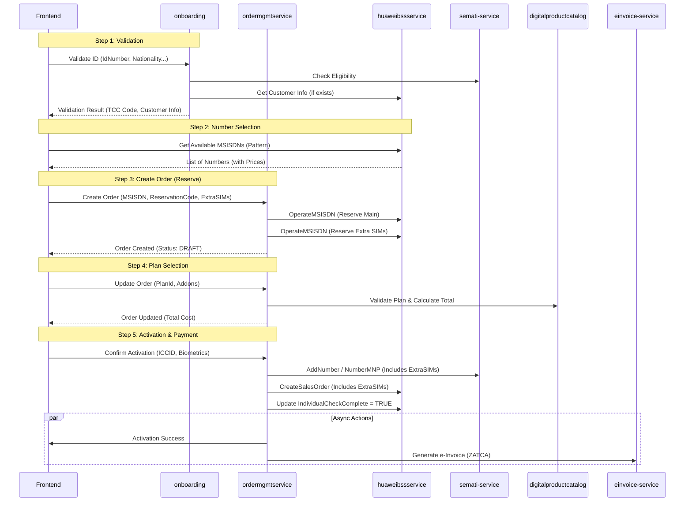

# Number Reservation & SIM Activation - Low Level Design (LLD)
# New Customer Onboarding & SIM Activation Flow

## Document Information
| Item | Value |
|------|-------|
| Version | 2.0 |
| Date | 2026-02-02 |


> **Note**: This document maps the legacy [SalesAPIController](file:///d:/SlsApp/RedBullSalesPortalRestSharp/RedBullSalesPortal/RedBullSalesPortal.Web/Modules/SalesAPI/SalesAPIController.cs#88-99) flow to the new Java Microservices architecture, preserving all business rules and integration details.

---

## 1. Executive Summary

### 1.1 Overview
The **Number Reservation & SIM Activation** flow is the core journey for acquiring a new mobile line. It encompasses:
1.  **Identity Validation**: Verifying customer eligibility via TCC.
2.  **Number Selection**: Browsing and reserving numbers from BSS inventory.
3.  **Plan Selection**: Choosing mobile plans and addons.
4.  **Order Management**: Creating and tracking the purchase order.
5.  **Activation**: Executing TCC activation (AddNumber) and BSS provisioning (CreateSalesOrder).

### 1.2 Microservices Architecture Map

The monolithic [SalesAPIController](file:///d:/SlsApp/RedBullSalesPortalRestSharp/RedBullSalesPortal/RedBullSalesPortal.Web/Modules/SalesAPI/SalesAPIController.cs#88-99) logic is decomposed into the following microservices:

| Logical Component | Legacy (.NET) | Java Microservice | Responsibility |
|-------------------|---------------|-------------------|----------------|
| **Entry/Validation** | [ValidateIdNew](file:///d:/SlsApp/RedBullSalesPortalRestSharp/RedBullSalesPortal/RedBullSalesPortal.Web/Modules/SalesAPI/SalesAPIController.cs#921-1095) | `onboarding-service` | ID validation, TCC eligibility check, Initial session |
| **Inventory** | [GetMSISDNs](file:///d:/SlsApp/RedBullSalesPortalRestSharp/RedBullSalesPortal/RedBullSalesPortal.Web/Modules/SalesAPI/SalesAPIController.cs#2983-2999) | `huaweibssservice` | Proxy to BSS `QueryAvailableNumber` |
| **Order Mgmt** | [UpdateOrder](file:///d:/SlsApp/RedBullSalesPortalRestSharp/RedBullSalesPortal/RedBullSalesPortal.Web/Modules/SalesAPI/SalesAPIController.cs#1163-1550) | `ordermgmtservice` | Order creation, state machine, persistence |
| **Catalog** | `GetPlans` | `digitalproductcatalog` | Plan & Addon details, Pricing |
| **Integration** | `TCCHelper` | `rbmdigitalcustomintegration` (semati) | TCC [CheckEligibility](file:///d:/SlsApp/RedBullSalesPortalRestSharp/RedBullSalesPortal/RedBullSalesPortal.Web/Modules/Common/Helpers/TCCApiHelper.cs#1722-1792), [AddNumber](file:///d:/SlsApp/RedBullSalesPortalRestSharp/RedBullSalesPortal/RedBullSalesPortal.Web/Modules/Common/Helpers/TCCApiHelper.cs#1001-1120) |
| **Integration** | [BssApiHelper](file:///d:/SlsApp/RedBullSalesPortalRestSharp/RedBullSalesPortal/RedBullSalesPortal.Web/Modules/Common/Helpers/BssApiHelper.cs#34-4260) | `huaweibssservice` | BSS `OperateMsisdn`, `CreateSaleOrder` |
| **Customer** | [GetCustomerInfo](file:///d:/SlsApp/RedBullSalesPortalRestSharp/RedBullSalesPortal/RedBullSalesPortal.Web/Modules/SalesAPI/SalesAPIController.cs#908-920) | `digitalcustomermanagement` | Customer profile creation/retrieval |
| **Invoicing** | [GenerateEInvoiceLocal](file:///d:/SlsApp/RedBullSalesPortalRestSharp/RedBullSalesPortal/RedBullSalesPortal.Web/Modules/SalesAPI/SalesAPIController.cs#3468-3485) | `einvoice-service` (TBD) | ZATCA e-Invoice generation (Future Implementation) |

### 1.3 Activation Types (SubType & IsPostpaid)

The system uses two distinct fields to control the flow:
1.  **`sub_type` (Enum)**: Determines the *Business Flow* (New SIM vs MNP vs Data).
2.  **`is_postpaid` (Boolean)**: Determines the *Account Type* in BSS.

| SubType | Name | Description | BSS Account Created |
|---------|------|-------------|---------------------|
| 0 | PrepaidNewSIM | New Prepaid SIM | Single Prepaid |
| 1 | PrepaidPortIn | Prepaid MNP | Single Prepaid |
| 2 | PrepaidDataSIM | Prepaid Data SIM | Single Prepaid |
| 3 | PostpaidNewSIM | New Postpaid SIM | Single Postpaid |
| 4 | PostpaidPortIn | Postpaid MNP | Single Postpaid |
| 5 | PostpaidDataSIM | Postpaid Data SIM | Single Postpaid |
| 6 | Device | Device Sale | (Depends on Plan) |

**Legacy Note**: The distinction between Hybrid/Broadband creating dual accounts is handled via [BssApiHelper](file:///d:/SlsApp/RedBullSalesPortalRestSharp/RedBullSalesPortal/RedBullSalesPortal.Web/Modules/Common/Helpers/BssApiHelper.cs#34-4260) logic based on `sub_type` + `is_postpaid` flags, but the primary enum follow the table above.

### 1.4 SubType to TCC SubscriptionType Mapping

The order's `sub_type` (0-6) maps to TCC [SubscriptionType](file:///d:/SlsApp/RedBullSalesPortalRestSharp/RedBullSalesPortal/RedBullSalesPortal.Web/Modules/Common/Helpers/BssApiHelper.cs#2917-2948) (0-2):

| Order SubType | TCC SubscriptionType | Flow |
|---------------|---------------------|------|
| 0 (PrepaidNewSIM) | 0 (Prepaid) | New Prepaid |
| 1 (PrepaidPortIn) | 0 (Prepaid) | MNP Prepaid |
| 2 (PrepaidDataSIM) | 0 (Prepaid) | Data SIM |
| 3 (PostpaidNewSIM) | 1 (Postpaid) | New Postpaid |
| 4 (PostpaidPortIn) | 1 (Postpaid) | MNP Postpaid |
| 5 (PostpaidDataSIM) | 1 (Postpaid) | Data Postpaid |
| 6 (Device) | (From Plan) | Device Sale |

**Note**: TCC SubscriptionType 2 (Hybrid/Broadband) is used for retry logic on code 605.

---

## 2. Java Microservices Flow Design

### 2.1 High-Level Sequence



---

## 3. Step-by-Step Implementation Details

### 3.1 Step 1: Identity Validation

**Legacy:** `SalesAPIController.ValidateIdNew`
**Service:** `onboarding-service`
**Endpoint:** `POST /api/v1/onboarding/validate-id`

#### Request
```json
{
    "idNumber": "1012345678",
    "idType": "CITIZEN",
    "nationality": 113,
    "birthDate": "1990-01-01",
    "isMNP": false,
    "channelId": 1,
    "subType": 0
}
```

#### Logic
1.  **POS Restriction**:
    - If `channelId == 1` (POS) AND `is_postpaid == TRUE`, Return ERROR "POS are not allowed to sell Postpaid".
2.  **Blacklist Check**: Check `BlackListIDs` table (entity: `BlackListIDsRow`).
3.  **TCC Eligibility**:
    - Call `semati-service` (`/v1/semati/api/eligibility`).
    - **Retry Logic (Code 605)**:
        - TCC uses its own [SubscriptionType](file:///d:/SlsApp/RedBullSalesPortalRestSharp/RedBullSalesPortal/RedBullSalesPortal.Web/Modules/Common/Helpers/BssApiHelper.cs#2917-2948) parameter (0=Prepaid, 1=Hybrid, 2=Broadband).
        - If `code == 605` AND TCC `SubscriptionType == 1` (Hybrid):
        - **RETRY** call with TCC `SubscriptionType = 2` (Broadband).
        - *Note*: This is distinct from the order's `sub_type` field.
4.  **Customer Lookup**:
    - Call `huaweibssservice` (`/customer/info`).
    - Map BSS response to local `Client` entity if exists.
5.  **TCC Exception Flags**:
    - Handle flags: `0` (Biometric), `1` (Diplomat), `8` (OTP), `9` (IAM Token), `11` (IAM App Token).

### 3.2 Step 2: Get MSISDNs

**Legacy:** `SalesAPIController.GetMSISDNs`, [BssApiHelper.cs](file:///d:/SlsApp/RedBullSalesPortalRestSharp/RedBullSalesPortal/RedBullSalesPortal.Web/Modules/Common/Helpers/BssApiHelper.cs)
**Service:** `huaweibssservice`
**Endpoint:** `POST /inventory/queryAvailableNumber`

#### Logic
1.  **SOAP Call**: `inv:QueryAvailableNumberReqMsg`.
2.  **Vanity Pricing & Filtering**:
    - Filter out Level 1 & 5 (Reserved).
    - Map Prices:
        | Tier | Price (SAR) | Status |
        |------|-------------|--------|
        | 1 | 15,000 | Reserved |
        | 2 | 5,000 | Sellable |
        | 3 | 2,500 | Sellable |
        | 4 | 0 | Basic |
        | 5 | 35,000 | Reserved |
        | 6 | 750 | Sellable |
        | 7 | 400 | Sellable |

### 3.3 Step 3: Select Number (Order Creation)

**Legacy:** `UpdateOrder (step="select-number")`
**Service:** `ordermgmtservice`
**Endpoint:** `POST /api/v1/orders`

#### Request
```json
{
    "msisdn": "551234567",
    "vanityLevel": 3,
    "reservationCode": "RES123",
    "isMNP": false,
    "extraSims": [
        { "type": "DATA", "enabled": true }
    ]
}
```

#### Logic
1.  **Create Entity**: Create `CustomerProductOrder` with status `DRAFT`.
2.  **Extra SIM Business Rules**:
    - **MNP Restriction**: If `isMNP == true` AND `extraSims.count > 0`, return ERROR "Extra SIMs not allowed with MNP".
    - **Cost Calculation**:
        - **First Extra SIM**: FREE.
        - **Subsequent SIMs**: 25 SAR each.
        - **VAT**: Add 15% VAT for Prepaid (`SubType=0`), No VAT for Postpaid (`SubType=3`).
        - *Formula*: [(Count - 1) * 25 * (VAT_Multiplier)](file:///d:/SlsApp/RedBullSalesPortalRestSharp/RedBullSalesPortal/RedBullSalesPortal.Web/Modules/SalesAPI/SalesAPIController.cs#111-128).
3.  **VAT Calculation (Main Number)**:
    - If `is_postpaid == FALSE`: `MSISDNCost` = `BasePrice` * 1.15.
    - If `is_postpaid == TRUE`: `MSISDNCost` = `BasePrice` (No VAT upfront).
4.  **Wallet Check**: Validate seller balance across Main Number + Extra SIMs.

### 3.4 Step 4: Select Plan

**Legacy:** `UpdateOrder (step="select-plan")`
**Service:** `ordermgmtservice`
**Endpoint:** `PUT /api/v1/orders/{orderId}/plan`

#### Logic
1.  **Validation**:
    - Verify `AllowedChannels`, `AllowedIDTypes`, `AllowedUsers` (Offer Limits per seller) for the Plan.
2.  **Cost Calculation** (Based on `is_postpaid` flag):
    - **Prepaid** (`is_postpaid=FALSE`): (PlanPrice + AddonsPrice) * 1.15.
    - **Postpaid** (`is_postpaid=TRUE`): PlanPrice + AddonsPrice (No VAT upfront).
    - **Commission (POS Only - Channel 1)**:
        - `Base` = `MSISDNCost` * 0.15
        - `PlanComm` = `Plan.Price` * `Plan.CommissionRate`
        - `AddonComm` = SUM(`Addon.Price` * `Addon.SpecialCommission`)
        - **Final** = `MAX(Base, PlanComm, AddonComm)`

### 3.5 Step 5: Authentication & Activation

**Legacy:** `UpdateOrder (step="authenticate")`
**Service:** `ordermgmtservice`
**Endpoint:** `POST /api/v1/orders/{orderId}/activate`

#### Request
```json
{
    "iccid": "899661...",
    "imsi": "...",
    "eSim": false,
    "biometrics": { "fingerIndex": 1, "image": "..." },
    "nafathToken": "...",
    "exceptionFlag": 0,
    "latitude": 24.7136,
    "longitude": 46.6753,
    "extraSims": [
        { "iccid": "899661...", "msisdn": "..." }
    ]
}
```

#### Logic (State Machine & SAGA)
1.  **Validation**: `ValidateLocation` (Legacy ignores lat/long check, but API accepts it).
2.  **SIM Validation**:
    - **Regex**: `^899661\d{13,14}$` (Accepts both 19 and 20 digit patterns for **ANY** SIM type).
    - **eSIM Flow**:
        - If `isESim=true`, Call `huaweibssservice` -> [PickESim](file:///d:/SlsApp/RedBullSalesPortalRestSharp/RedBullSalesPortal/RedBullSalesPortal.Web/Modules/Common/Helpers/BssApiHelper.cs#2464-2497) to allocate ICCID/IMSI.
        - Skip regex check for allocated eSIMs (trusted source).
3.  **TCC Activation**:
    - Call `semati-service`.
    - **Retry Logic (Code 605)**: If TCC returns 605, retry logic depends on [SubscriptionType](file:///d:/SlsApp/RedBullSalesPortalRestSharp/RedBullSalesPortal/RedBullSalesPortal.Web/Modules/Common/Helpers/BssApiHelper.cs#2917-2948) (Mapped from Plan/Offering, not just SubType).
    - **Audit**: Log request/responses to `tcc_traces` table.
4.  **BSS Activation**:
    - **Standard Order**: Call `huaweibssservice` -> [CreateSalesOrder](file:///d:/SlsApp/RedBullSalesPortalRestSharp/RedBullSalesPortal/RedBullSalesPortal.Web/Modules/Common/Helpers/BssApiHelper.cs#3381-3420).
    - **MNP Order (SubType 1, 4)**: Call `huaweibssservice` -> [CreateSalesMNPOrder](file:///d:/SlsApp/RedBullSalesPortalRestSharp/RedBullSalesPortal/RedBullSalesPortal.Web/Modules/Common/Helpers/BssApiHelper.cs#3421-3460).
    - **Device Order (SubType 6)**: Call `huaweibssservice` -> [CreateSalesOrderWithDevice](file:///d:/SlsApp/RedBullSalesPortalRestSharp/RedBullSalesPortal/RedBullSalesPortal.Web/Modules/Common/Helpers/BssApiHelper.cs#3341-3380).
    - **Logic**: Use `BillCycleType` "15" (Prepaid) or "28" (Postpaid).
5.  **Critical Success Flag**:
    - If BSS Success: Set `IndividualCheckComplete = TRUE` in DB.
    - **SAGA Implementation**:
        - If BSS Fails AND `IndividualCheckComplete == FALSE`: Auto-Rollback TCC ([CancelNumber](file:///d:/SlsApp/RedBullSalesPortalRestSharp/RedBullSalesPortal/RedBullSalesPortal.Web/Modules/Common/Helpers/TCCApiHelper.cs#610-687)).
        - If BSS Fails AND `IndividualCheckComplete == TRUE`: DO NOT Rollback (Manual fix required).
    - **IMSI Derivation** (All SIM Types):
        - Formula: `"420100000" + ICCID.Substring(13, 6)`
        - If ICCID is 20 digits, remove check digit first.
6.  **Post-Activation (Async)**:
    - **SMS**: Send confirmation SMS **immediately** after activation success.
    - **OTP**: OTP tokens expire after 2 minutes (`DateTime.Now.AddMinutes(2)`).
    - **Wallet Deduction Flow**:
        1. **Validation**: Check `seller.balance >= orderTotal` at EACH step.
        2. **Deduction**: ONLY after BSS [CreateSalesOrder](file:///d:/SlsApp/RedBullSalesPortalRestSharp/RedBullSalesPortal/RedBullSalesPortal.Web/Modules/Common/Helpers/BssApiHelper.cs#3381-3420) succeeds.
        3. **Commission Credit**: After deduction (POS only).
        4. **Tracking**: Update `wallet_balance_before`, `wallet_balance_after`.
    - **Contract**: Generate eContract (Postpaid).
    - **eInvoice**: If `Channel IN [5, 6, 8, 10]`, call `einvoice-service`.
    - **Nafath Note**: Logic migrated from legacy [TCCApiHelper](file:///d:/SlsApp/RedBullSalesPortalRestSharp/RedBullSalesPortal/RedBullSalesPortal.Web/Modules/Common/Helpers/TCCApiHelper.cs#24-1838) ([CreateNafathAppRequest](file:///d:/SlsApp/RedBullSalesPortalRestSharp/RedBullSalesPortal/RedBullSalesPortal.Web/Modules/SalesAPI/SalesAPIController.cs#3334-3340)).

---

## 4. Database Schema Updates

### 4.1 ordermgmtservice (`ordermgmt_db`)

```sql
ALTER TABLE customer_product_order ADD COLUMN
  sub_type INT,                    -- 0=PrepaidNewSIM, 1=PrepaidPortIn, 2=PrepaidDataSIM, 3=PostpaidNewSIM...
  is_postpaid BOOLEAN,             -- TRUE for Postpaid accounts
  is_esim BOOLEAN,
  is_mnp BOOLEAN,
  individual_check_complete BOOLEAN DEFAULT FALSE, -- Critical SAGA flag
  commission DECIMAL(18,2),
  wallet_balance_before DECIMAL(18,2),
  wallet_balance_after DECIMAL(18,2),
  imsi VARCHAR(20),
  plan_cost DECIMAL(18,2),
  addons_cost DECIMAL(18,2),
  extra_sim_cost DECIMAL(18,2),
  id_type INT,
  nationality INT,
  birth_date DATE,
  channel_id INT;

CREATE TABLE extra_sim_oto_order (
  id BIGINT PRIMARY KEY,
  order_id BIGINT REFERENCES customer_product_order(id),
  msisdn VARCHAR(15),
  iccid VARCHAR(20),
  imsi VARCHAR(20),
  status VARCHAR(20),
  sim_type VARCHAR(10),  -- PHYSICAL, ESIM
  cost DECIMAL(18,2),
  created_at TIMESTAMP
);

CREATE TABLE activation_state (
  id BIGINT PRIMARY KEY,
  order_id BIGINT REFERENCES customer_product_order(id),
  current_phase VARCHAR(30),
  phase_started_at TIMESTAMP,
  phase_completed_at TIMESTAMP,
  retry_count INT DEFAULT 0,
  error_message TEXT,
  created_at TIMESTAMP
);

CREATE TABLE tcc_traces (
  id BIGINT PRIMARY KEY,
  order_id BIGINT,
  request_type INT,
  request_body TEXT,
  response_body TEXT,
  response_code INT,
  tcn VARCHAR(100),
  created_at TIMESTAMP
);

CREATE TABLE commitment_matrix (
  id BIGINT PRIMARY KEY,
  plan_id VARCHAR(50),
  msisdn_price_range_min DECIMAL(18,2),
  msisdn_price_range_max DECIMAL(18,2),
  duration_months INT,
  agreement_text TEXT
);
```

### 4.2 State Machine Definition (Java `ActivationPhase`)

| State | Status Name | Description |
|-------|-------------|-------------|
| 0 | `INITIATED` | Order created |
| 1 | `NAFATH_PENDING` | Waiting for Nafath verification |
| 2 | `NAFATH_COMPLETED` | Nafath done |
| 3 | `SEMATI_VALIDATED` | TCC Check done |
| 4 | `CUSTOMER_UPDATED` | BSS Customer Info Validated |
| 5 | `BSS_PROVISIONED` | BSS Order Created |
| 6 | `NOTIFICATION_SENT`| SMS/Email Sent |
| 7 | `COMPLETED` | Fully Active |
| -1 | `FAILED` | Process Failed |

### 4.3 BSS Configuration Reference

| Account Type | BillCycleType | PaymentType |
|--------------|---------------|-------------|
| **Prepaid** | "15" | 0 |
| **Postpaid** | "28" | 1 |

### 4.4 BSS Account Creation Rules (Dual Accounts)

| SubType | IsPostpaid | Accounts Created |
|---------|------------|------------------|
| 0 (Prepaid) | FALSE | Prepaid only (PaymentType=0) |
| 0 (Prepaid) | TRUE | Prepaid + Postpaid |
| 2 (Hybrid) | Any | Prepaid (default) + Postpaid |
| Any | TRUE | Adds Postpaid account (PaymentType=1) |

---

## 5. API Integration Specifications

### 5.1 BSS Service Interface (`huaweibssservice`)

**CreateSalesOrder**
- **Method**: `POST /create-sale-order` (Camel Route)
- **Body**: `{ "full_order_object" }`

### 5.2 TCC Service Interface (`semati-service`)

**Endpoints** (Java Implementation):
- `POST /v1/semati/api/eligibility`
- `POST /v1/semati/api-tcc/individual/v2/verify` (Action: AddNumber/NumberMNP)

### 5.3 eInvoice Integration (`einvoice-service`)

**Generate Invoice**
- **Trigger**: Async after activation.
- **Channels**: 5, 6, 8, 10.
- **Logic**: Calculate pure VAT amount (`Total / 1.15`).

---

## 6. Error Codes & Recovery

| Code | Source | Message | HTTP | Recovery |
|------|--------|---------|------|----------|
| 605 | TCC | Plan Restriction | 400 | Retry with TCC SubscriptionType=2 (if current=1) |
| 600 | TCC | Success | - | - |
| POS_POSTPAID | App | POS cannot sell Postpaid | 400 | User education |
| MNP_EXTRASIM | App | Extra SIMs not allowed with MNP | 400 | Remove Extra SIMs |
| INVALID_ICCID | App | ICCID regex mismatch | 400 | Check SIM (19 vs 20 digits) |

### 6.1 Channel Reference

| Channel ID | Name | Can Sell Postpaid | ZATCA Required | Commission Eligible |
|------------|------|-------------------|----------------|---------------------|
| 1 | POS | ❌ No | ❌ No | ✅ Yes |
| 5 | Digital-1 | ✅ Yes | ✅ Yes | ❌ No |
| 6 | Digital-2 | ✅ Yes | ✅ Yes | ❌ No |
| 8 | Digital-3 | ✅ Yes | ✅ Yes | ❌ No |
| 10 | Digital-4 | ✅ Yes | ✅ Yes | ❌ No |
