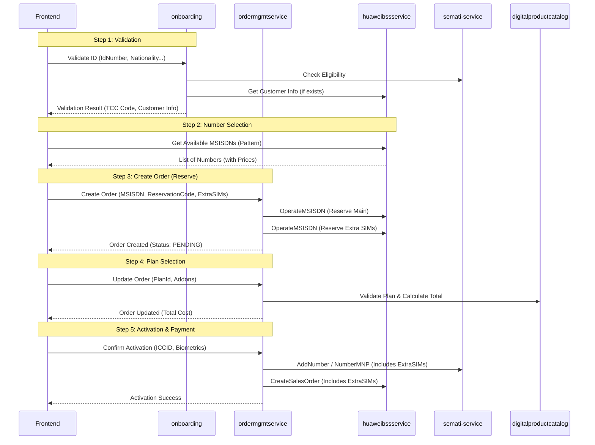

# Number Reservation & SIM Activation - Low Level Design (LLD)
# New Customer Onboarding & SIM Activation Flow

## Document Information
| Item | Value |
|------|-------|
| Version | 1.1 |
| Date | 2026-01-22 |
| Author | Architecture Team |
| Status | **Draft** |
| Flow Type | New SIM Activation (Prepaid/Postpaid) |
| Target Platform | Java Microservices |

> **Note**: This document maps the legacy `SalesAPIController` flow to the new Java Microservices architecture, preserving all business rules and integration details.

---

## 1. Executive Summary

### 1.1 Overview
The **Number Reservation & SIM Activation** flow is the core journey for acquiring a new mobile line. It encompasses:
1.  **Identity Validation**: Verifying customer eligibility via TCC.
2.  **Number Selection**: Browsing and reserving numbers from BSS inventory.
3.  **Plan Selection**: Choosing mobile plans and addons.
4.  **Order Management**: Creating and tracking the purchase order.
5.  **Activation**: Executing TCC activation (AddNumber) and BSS provisioning (CreateSalesOrder).

### 1.2 Microservices Architecture Map

The monolithic `SalesAPIController` logic is decomposed into the following microservices:

| Logical Component | Legacy (.NET) | Java Microservice | Responsibility |
|-------------------|---------------|-------------------|----------------|
| **Entry/Validation** | `ValidateIdNew` | `onboarding-service` | ID validation, TCC eligibility check, Initial session |
| **Inventory** | `GetMSISDNs` | `huaweibssservice` | Proxy to BSS `QueryAvailableNumber` |
| **Order Mgmt** | `UpdateOrder` | `ordermgmtservice` | Order creation, state machine, persistence |
| **Catalog** | `GetPlans` | `digitalproductcatalog` | Plan & Addon details, Pricing |
| **Integration** | `TCCHelper` | `rbmdigitalcustomintegration` (semati) | TCC `CheckEligibility`, `AddNumber` |
| **Integration** | `BssApiHelper` | `huaweibssservice` | BSS `OperateMsisdn`, `CreateSaleOrder` |
| **Customer** | `GetCustomerInfo` | `digitalcustomermanagement` | Customer profile creation/retrieval |

---

## 2. Java Microservices Flow Design

### 2.1 High-Level Sequence



---

## 3. Step-by-Step Implementation Details

### 3.1 Step 1: Identity Validation

**Legacy:** `SalesAPIController.ValidateIdNew`
**Service:** `onboarding-service`
**Endpoint:** `POST /api/v1/onboarding/validate-id`

#### Request
```json
{
    "idNumber": "1012345678",
    "idType": "CITIZEN",
    "nationality": 113,
    "birthDate": "1990-01-01",
    "isMNP": false
}
```

#### Logic
1.  **Blacklist Check**: Check `BlacklistedNatID` table in `onboarding_db`.
2.  **TCC Eligibility**:
    - Call `semati-service` (`/check-eligibility`).
    - **Rule**: If `code != 600`, return error.
    - **Logic**: For MNP (`isMNP=true`), skip TCC eligibility (as per legacy).
3.  **Customer Lookup**:
    - Call `huaweibssservice` (`/customer/info`).
    - Map BSS response to local `Client` entity if exists.
4.  **Response**: Return `tccReference`, `customerStatus`.

### 3.2 Step 2: Get MSISDNs

**Legacy:** `SalesAPIController.GetMSISDNs`
**Service:** `huaweibssservice`
**Endpoint:** `GET /api/v1/inventory/msisdn`

#### Logic
This service acts as a transparent proxy to BSS SOAP `QueryAvailableNumber`.

1.  **Input**: `pattern` (e.g., "055"), `vanityLevel` (default 4/Basic), `count`.
2.  **SOAP Call**: `inv:QueryAvailableNumberReqMsg`.
3.  **Filtering**:
    - Filter out Level 1 & 5 (Reserved).
    - Map BSS `Level` to Price (using `digitalproductcatalog` or local config).
4.  **Normalization**: Ensure output is `5xxxxxxxx`.

### 3.3 Step 3: Select Number (Order Creation)

**Legacy:** `UpdateOrder (step="select-number")`
**Service:** `ordermgmtservice`
**Endpoint:** `POST /api/v1/orders`

#### Request
```json
{
    "msisdn": "551234567",
    "vanityLevel": 3,
    "reservationCode": "RES123",
    "extraSims": [
        { "type": "DATA", "enabled": true }
    ]
}
```

#### Logic
1.  **Create Entity**: Create `CustomerProductOrder` with status `DRAFT`.
2.  **Reserve Main Number**:
    - Call `huaweibssservice` -> `OperateMsisdn` (OpType=1029).
3.  **Extra SIM Handling**:
    - For each requested Extra SIM:
        - Call `huaweibssservice` -> `GetDataMSISDN` (to get a number if not provided).
        - Call `huaweibssservice` -> `OperateMsisdn` (Reserve).
        - Create `ExtraSimOtoOrder` entity linked to `CustomerProductOrder`.
        - Add cost to `extraSimCost`.
4.  **VAT Calculation**:
    - `MSISDNCost` = `BasePrice` * 1.15 (Prepaid).
    - `MSISDNCost` = `BasePrice` * 1.15 (Postpaid).
5.  **Wallet Check (Initial)**: Validate seller balance >= `MSISDNCost` + `ExtraSimCost`.

### 3.4 Step 4: Select Plan

**Legacy:** `UpdateOrder (step="select-plan")`
**Service:** `ordermgmtservice`
**Endpoint:** `PUT /api/v1/orders/{orderId}/plan`

#### Request
```json
{
    "productOfferingId": "PLAN_100",
    "addons": ["ADD_5GB", "ADD_SOCIAL"]
}
```

#### Logic
1.  **Catalog Validation**: Verify IDs against `digitalproductcatalog`.
2.  **Cost Calculation**:
    - **Prepaid**: (PlanPrice + AddonsPrice) * 1.15.
    - **Postpaid**: (PlanPrice + AddonsPrice) (No VAT added to order total, billed later).
3.  **Update Order**: Update `orderAmount`, `productOfferingId`.
4.  **Validation**: `orderAmount` + `msisdnCost` + `extraSimCost` <= `SellerWalletBalance`.

### 3.5 Step 5: Authentication & Activation

**Legacy:** `UpdateOrder (step="authenticate")`
**Service:** `ordermgmtservice`
**Endpoint:** `POST /api/v1/orders/{orderId}/activate`

#### Request
```json
{
    "iccid": "899661...",
    "eSim": false,
    "biometrics": { "fingerIndex": 1, "image": "..." },
    "nafathToken": "...",
    "extraSims": [
        { "iccid": "899661...", "msisdn": "..." }
    ]
}
```

#### Logic (State Machine)
1.  **Idempotency Link**: `ActivationState`.
2.  **SIM Validation (Main & Extra)**:
    - Verify ICCID format: `^899661\d{13,14}$`.
    - If eSIM: Call `huaweibssservice` -> `PickESim`.
    - Update `CustomerProductOrder.iccid` and `ExtraSimOtoOrder.iccid`.
3.  **State Transition -> IN_FLIGHT_TCC**:
4.  **TCC Activation**:
    - Call `rbmdigitalcustomintegration` (semati).
    - **Input**: Main MSISDN + List of Extra SIMs (Passed in TCC `simList`).
    - If MNP: `NumberMNP`.
    - If New: `AddNumber`.
    - **Success**: Status -> `TCC_DONE`.
5.  **State Transition -> IN_FLIGHT_BSS**:
6.  **BSS Activation**:
    - Call `huaweibssservice` -> `CreateSaleOrder`.
    - **Input**: Full order object including `ExtraSim` list.
    - **Success**: Status -> `COMPLETED`.
7.  **Wallet Deduction**:
    - Call `accounts-receivable-service` -> `DeductBalance`.

---

## 4. Database Schema Updates

### 4.1 ordermgmtservice (`ordermgmt_db`)

Updates to `CustomerProductOrder` to support specific reservation fields.

```sql
-- Existing 'CustomerProductOrder' table updates
ALTER TABLE customer_product_order
ADD COLUMN vanity_level INT,
ADD COLUMN msisdn_cost DECIMAL(18,2), -- Cost of number alone
ADD COLUMN reservation_code VARCHAR(50),
ADD COLUMN activation_state VARCHAR(20), -- State Machine
ADD COLUMN eligibility_tcn VARCHAR(100),
ADD COLUMN activation_tcn VARCHAR(100),
ADD COLUMN seller_id INT;

-- Ensure Extra SIM table exists (confirmed in schema)
-- extra_sim_oto_order (otoOrderId, msisdn, iccid, status)
```

### 4.2 State Machine Definition

In `ordermgmtservice` -> `ActivationState`:

| State | Status in DB | Description |
|-------|--------------|-------------|
| 0 | `INIT` | Order created, number reserved locally |
| 1 | `TCC_IN_PROGRESS` | TCC call started |
| 2 | `TCC_COMPLETED` | TCC AddNumber success (TCN received) |
| 3 | `BSS_IN_PROGRESS` | BSS CreateOrder started |
| 4 | `COMPLETED` | Activation success |
| 5 | `FAILED` | Failed at any stage (Manual intervention/Retry) |

---

## 5. API Integration Specifications

### 5.1 BSS Service Interface (`huaweibssservice`)

**OperateMsisdn (Reserve)**
- **Method**: `POST /api/v1/inventory/reserve`
- **Body**: `{ "msisdn": "55...", "operation": "RESERVE" }`
- **Backend**: Maps to SOAP `OperateMsisdn` (OpType 1029).

**CreateSalesOrder**
- **Method**: `POST /api/v1/orders/bss-create`
- **Body**: `{ "full_order_object" }`
- **Backend**: Maps to SOAP `CreateSaleOrder`.

### 5.2 TCC Service Interface (`semati-service`)

**CheckEligibility**
- **Method**: `POST /api/v1/semati/eligibility`

**AddNumber**
- **Method**: `POST /api/v1/semati/activate`
- **Body**: `{ "msisdn": "...", "person": { ... }, "simList": [...] }`
- **Note**: `simList` includes Main SIM + Extra SIMs.

---

## 6. Business Rules & Configuration

### 6.1 Configuration (`application.yml` in `ordermgmtservice`)

```yaml
activation:
  vat-rate: 0.15
  constraints:
    validate-wallet: true
    pos-postpaid-allowed: false # POS (Channel 1) cannot sell Postpaid
  timeouts:
    tcc-seconds: 30
    bss-seconds: 60
```

### 6.2 Key Rules Implementation

1.  **POS Postpaid Restriction**:
    - *Logic*: Check `context.getChannel()` and `order.isPostpaid()`.
    - *Implementation*: `OrderValidator` bean in `ordermgmtservice`.

2.  **Wallet Deduction**:
    - *Logic*: "OrderTotal" is deducted.
    - *Prepaid*: Total = (Number + Plan + Addons) * 1.15.
    - *Postpaid*: Total = (Number * 1.15) + Plan + Addons.
    - *Critical*: Validation happens at EVERY step (Number, Plan, Final).

3.  **Concurrency**:
    - Use `@Version` on `CustomerProductOrder` (JPA Optimistic Locking) to parallel the legacy `RowVersion` logic.

### 6.3 Error Handling (Legacy Parity)

| Error Condition | Legacy Message | Microservice Handing |
|-----------------|----------------|----------------------|
| Wallet < Total | "Insufficient Wallet Balance" | `PaymentService` throws `InsufficientBalanceException` |
| TCC Fail | "TCC{code}: {msg}" | `SematiIntegrationException` with code |
| Already Active | "Order already in progress" | `OrderStateValidator` checks `activationState > 0` |

---

## 7. Migration Notes

- **Data Migration**: Existing `SalesOrder` records should be migrated to `CustomerProductOrder`.
- **Downtime**: switch-over requires all pending orders to be cleared or manually migrated.
- **Rollback**: Legacy `SalesAPIController` relies on single transaction or simple flow. Microservices uses distributed calls.
- **SAGA**: Use SAGA pattern for `Activation`:
    - 1. TCC Success -> 2. BSS Fail -> **Compensating Action**: Queue for Manual Fix (RedBull TCC deactivation is restricted).

---
